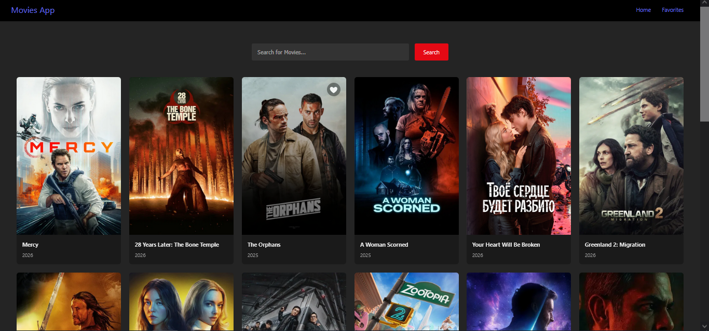
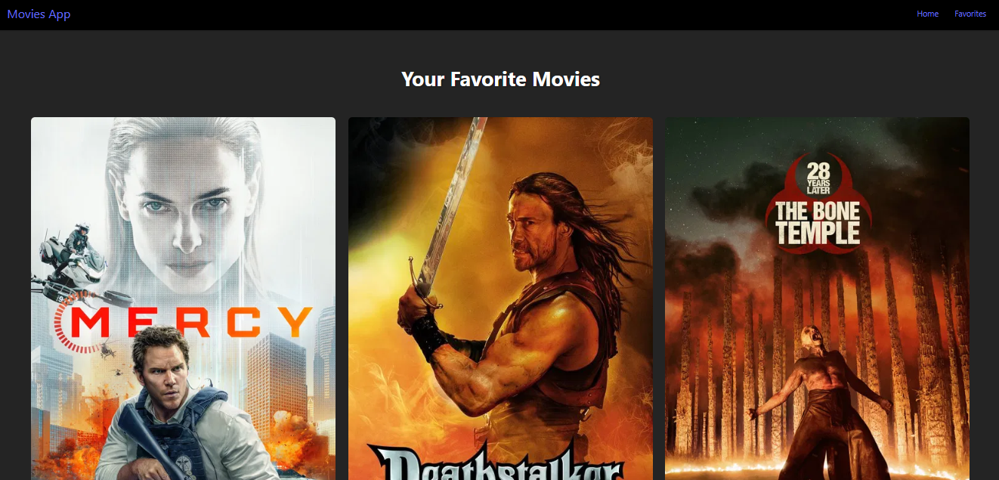
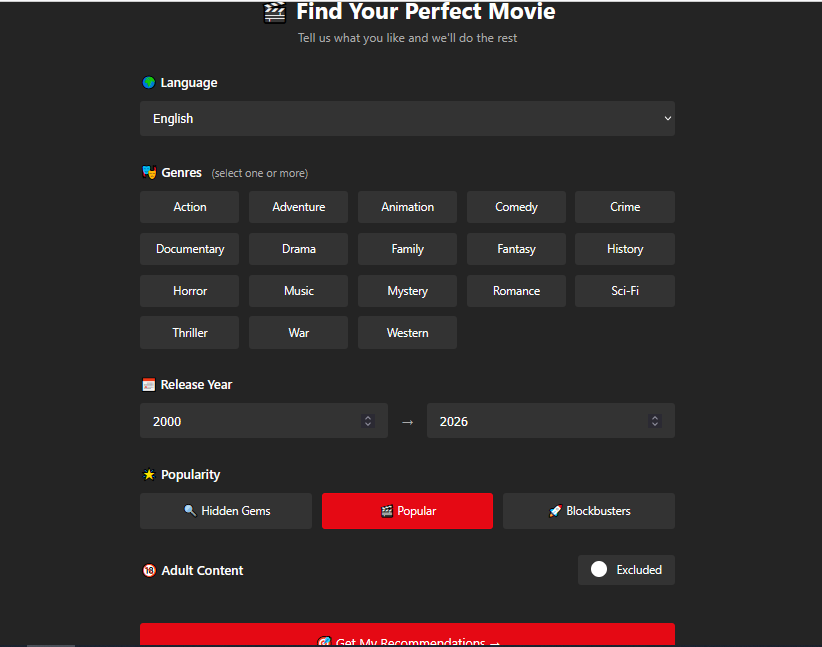
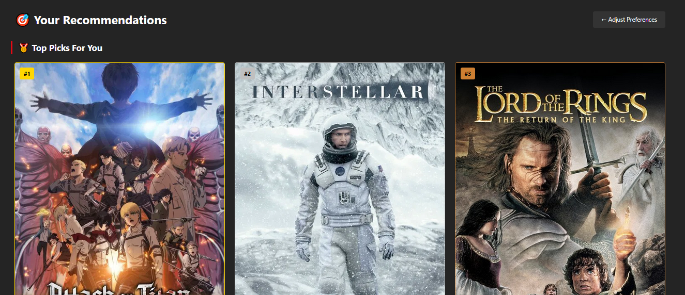

### Home Page


### Favorites Page


### Preferences Page


### Recommendations Page


# React Movies Project 🎬

A React.js movie browser integrating the TMDb API with instant search, detailed movie info, favorites management, and a personalized recommendation engine powered by a custom multi-criteria scoring algorithm. Built with Vite and deployed on Vercel.

---

## 🚀 Features

- Browse popular movies fetched from TMDb API
- Search movies by title
- View detailed movie information (poster, rating, overview, release date)
- Add/remove movies to a **Favorites** list
- Dedicated **Favorites** page to see saved movies
- Persistent favorites using `localStorage` (favorites remain after page refresh)
- 🎯 **Personalized Recommendations** — filter by language, genre, release year, and popularity
- 🧠 **Custom Scoring Engine** — ranks movies dynamically based on rating, genre match, popularity, and recency
- Responsive layout for desktop and mobile

---

## 🛠 Tech Stack

- **React** (with hooks and context)
- **Vite** (development bundler)
- **JavaScript** (custom client-side scoring engine)
- **TMDb API** for movie data with dynamic query parameters
- **CSS** for styling (fully custom, no component libraries)
- **Vercel** for deployment

---

## 📦 Getting Started

### 1. Clone the repository

```bash
git clone https://github.com/Zakaria-Karaoui/React-Movies-Project.git
cd React-Movies-Project
```

### 2. Install dependencies

```bash
npm install
```

### 3. Configure environment variables

```
VITE_TMDB_API_KEY=YOUR_TMDB_API_KEY_HERE
```

### 4. Run the development server

```bash
npm run dev
```

Then open the URL shown in the terminal (usually http://localhost:5173).

---

## 📁 Project Structure

```
src/
  components/
    MovieCard.jsx
    Navbar.jsx
    ...
  pages/
    Home.jsx
    Favorites.jsx
    MovieDetails.jsx
    Recommendations.jsx
  contexts/
    MovieContext.jsx
  css/
    Favorites.css
    MovieCard.css
    ...
  App.jsx
  main.jsx
```

---

## 📡 TMDb API

This project uses the TMDb API to fetch:

- Popular movies
- Movie details by ID
- Search results by title
- Filtered results for personalized recommendations

You must create a free account and API key on the official TMDb website. Be sure to follow their terms of use and attribution guidelines.

---

## 🙌 Acknowledgements

- [The Movie Database (TMDb)](https://www.themoviedb.org/) for providing the movie data API.
- The React and Vite communities for great tooling and documentation.
